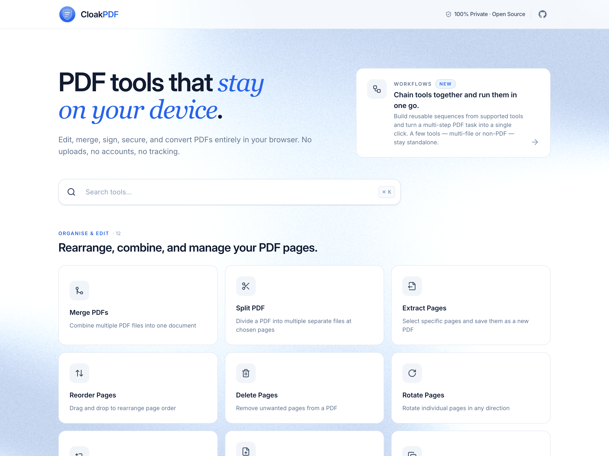

<div align="center">

  

  <h1>BytePDF</h1>

  <p>A fast, modern, and privacy-focused PDF toolkit that runs entirely in your browser.<br>
  No uploads, no servers, no tracking — your files never leave your device.</p>

  <p><strong>Try it here →</strong> <a href="http://bytepdf.app/">bytepdf.app</a></p>

  <p>
    
    
    <a href="https://opensource.org/licenses/MIT"></a>
  </p>
  <p>
    
    <a href="https://securityscorecards.dev/viewer/?uri=github.com/sumitsahoo/bytepdf"></a>
    
  </p>

</div>

<p align="center">
  
</p>

---

## ✨ Features

BytePDF offers **30 powerful PDF tools**, all running 100% client-side:

### 🗂️ Organise & Edit

_Rearrange, combine, and manage your PDF pages_

| Tool                   | Description                                                                      |
| ---------------------- | -------------------------------------------------------------------------------- |
| **Merge PDFs**         | Combine multiple PDF files into a single document with drag-to-reorder support   |
| **Extract Pages**      | Select pages visually or by range (e.g., `1-3, 5, 7-9`) and save as a new PDF    |
| **Reorder Pages**      | Drag and drop to rearrange page order with smooth animations                     |
| **Delete Pages**       | Select and remove unwanted pages visually                                        |
| **Rotate Pages**       | Rotate individual pages by 90°, -90°, or 180° — or rotate all at once            |
| **Add Blank Page**     | Insert a blank page at any position — dimensions match the adjacent page         |
| **Duplicate Page**     | Copy any page and insert it at a chosen position in the document                 |
| **Reverse Pages**      | Flip the entire page order of a PDF in one click                                 |
| **Add Bookmarks**      | Add a clickable outline so readers can jump to any page instantly                |
| **Remove Blank Pages** | Auto-detect and remove empty pages — adjustable sensitivity with manual override |

### ⚡ Transform & Convert

_Compress, convert, and extract content_

| Tool              | Description                                                                                                                        |
| ----------------- | ---------------------------------------------------------------------------------------------------------------------------------- |
| **Compress PDF**  | Reduce file size with 3 quality levels — Light, Balanced, and Maximum                                                              |
| **PDF to Image**  | Export pages as PNG or JPEG at 72 / 150 / 300 DPI — single file or ZIP                                                             |
| **Images to PDF** | Convert images (PNG, JPEG) to PDF with A4, Letter, or Fit-to-Image page sizes                                                      |
| **OCR PDF**       | Extract text from scanned or image-based PDFs using Tesseract.js OCR                                                               |
| **Crop Pages**    | Trim page margins by setting a crop box (mm input, uniform or per-side); also removes existing crop boxes to restore the full page |
| **Flatten PDF**   | Remove interactive form fields and annotations, making the PDF non-editable                                                        |
| **N-up Pages**    | Arrange multiple pages onto a single sheet (2-up, 4-up, 9-up) for compact printing                                                 |
| **Contact Sheet** | Render all pages as a thumbnail grid for quick visual review — export as PNG or PDF                                                |
| **Repair PDF**    | Fix structural issues in corrupted or malformed PDFs by re-parsing and rebuilding the file                                         |
| **Grayscale PDF** | Convert all pages to grayscale — useful for print cost savings and black-and-white output                                          |

### ✍️ Annotate & Sign

_Add watermarks, signatures, and overlays_

| Tool                  | Description                                                                                                                                                        |
| --------------------- | ------------------------------------------------------------------------------------------------------------------------------------------------------------------ |
| **Add Signature**     | Draw or upload a custom signature image and place it on any page with adjustable size and position                                                                 |
| **Fill PDF Form**     | Fill text fields, checkboxes, dropdowns, and radio groups in interactive PDF forms                                                                                 |
| **Stamp & Watermark** | Apply pre-built stamps (DRAFT, APPROVED, CONFIDENTIAL, etc.) in text or seal style, or add a custom text watermark with configurable colour, rotation, and opacity |
| **Add Page Numbers**  | Insert page numbers with 6 position options, 4 formats, and custom styling                                                                                         |
| **Bates Numbering**   | Stamp sequential identifiers (prefix + zero-padded number + suffix) for legal and compliance workflows                                                             |
| **Header & Footer**   | Add repeating text (with `{{page}}` / `{{total}}` tokens) at the top and bottom of every page                                                                      |

### 🔐 Security & Properties

_Protect your PDFs and manage metadata_

| Tool              | Description                                                                             |
| ----------------- | --------------------------------------------------------------------------------------- |
| **PDF Password**  | Add or remove a password and control print, copy, and edit rights                       |
| **Redact PDF**    | Permanently black out sensitive text and images                                         |
| **Edit Metadata** | View and edit document properties like title, author, subject, keywords, and dates      |
| **PDF Inspector** | View version, page count, dimensions, metadata, and encryption status without modifying |

---

## 🔒 Privacy First

|                               |                                                         |
| ----------------------------- | ------------------------------------------------------- |
| **No file uploads**           | Everything is processed locally in your browser         |
| **No server-side processing** | Zero network requests for your files                    |
| **No data collection**        | No analytics, no tracking, no cookies                   |
| **Fully offline capable**     | Works without an internet connection after initial load |

---

## 🛠️ Tech Stack

| Category         | Technology                                                     |
| ---------------- | -------------------------------------------------------------- |
| Framework        | [React 19](https://react.dev/)                                 |
| Styling          | [Tailwind CSS 4](https://tailwindcss.com/)                     |
| Build Tool       | [Vite+](https://vite.dev/) (Vite + Rolldown unified toolchain) |
| Language         | [TypeScript 6](https://www.typescriptlang.org/)                |
| PDF Manipulation | [pdf-lib](https://pdf-lib.js.org/)                             |
| PDF Rendering    | [PDF.js](https://mozilla.github.io/pdf.js/)                    |
| Font Support     | [@pdf-lib/fontkit](https://github.com/Hopding/fontkit)         |
| Drag & Drop      | [dnd-kit](https://dndkit.com/)                                 |
| Icons            | [Lucide React](https://lucide.dev/)                            |
| OCR Engine       | [Tesseract.js](https://tesseract.projectnaptha.com/)           |
| ZIP Export       | [JSZip](https://stuk.github.io/jszip/)                         |
| Toolchain CLI    | [Vite+ (`vp`)](https://viteplus.dev/)                          |

---

## 🚀 Getting Started

### Prerequisites

- **Node.js** ≥ 24.x (LTS recommended)
- **Vite+ (`vp`)** — install globally via `npm i -g vite-plus`

### Installation

```bash
# Clone the repository
git clone https://github.com/sumitsahoo/bytepdf.git
cd bytepdf

# Install dependencies
vp install

# Start the development server
vp dev
```

### Available Commands

| Command      | Description                               |
| ------------ | ----------------------------------------- |
| `vp dev`     | Start the Vite dev server with hot reload |
| `vp build`   | TypeScript check + production build       |
| `vp preview` | Preview the production build locally      |
| `vp check`   | Run format, lint, and type checks         |
| `vp test`    | Run tests                                 |

---

## 📁 Project Structure

```
bytepdf/
├── public/                 # Static assets
├── src/
│   ├── main.tsx            # App entry point
│   ├── App.tsx             # Root component with lazy-loaded tools
│   ├── index.css           # Global styles & Tailwind theme
│   ├── types.ts            # TypeScript type definitions
│   ├── assets/             # Images & icons
│   ├── components/         # Reusable UI components (layout, drop zone, thumbnails, etc.)
│   ├── config/             # Color palette & theme tokens
│   ├── tools/              # One component per tool (merge, split, compress, etc.)
│   └── utils/              # Core PDF operations, file helpers, rendering
├── index.html              # HTML entry point
├── vite.config.ts          # Vite + Tailwind configuration
├── tsconfig.json           # TypeScript configuration
└── package.json
```

---

## ⚙️ How It Works

BytePDF leverages two complementary libraries for full PDF support:

- **[pdf-lib](https://pdf-lib.js.org/)** — Handles all PDF manipulation: merging, splitting, rotation, page deletion, watermarking, signature embedding, image-to-PDF conversion, and metadata editing.
- **[PDF.js](https://mozilla.github.io/pdf.js/)** — Renders PDF pages to canvas for visual previews and thumbnail generation.

All operations happen in-memory using the browser's `FileReader` API and `ArrayBuffer`s. Processed files are delivered as downloadable blobs — no data ever touches a remote server.

---

## 🚢 Deployment

BytePDF is deployed to **GitHub Pages** via a CI/CD workflow on every push to `main`.

The deployment pipeline:

1. Checks out the code
2. Installs dependencies with `vp install`
3. Builds the production bundle with Vite
4. Deploys the `dist/` folder to GitHub Pages

---

## 🤝 Contributing

Contributions are welcome! Here's how to get started:

1. **Fork** the repository
2. **Create** a feature branch (`git checkout -b feature/amazing-feature`)
3. **Commit** your changes (`git commit -m 'Add amazing feature'`)
4. **Push** to the branch (`git push origin feature/amazing-feature`)
5. **Open** a Pull Request

---

## 📄 License

This project is licensed under the **MIT License** — feel free to use it for both personal and commercial purposes. See the [LICENSE](LICENSE) file for details.

---

<p align="center">
  Built with ❤️ by <a href="https://github.com/sumitsahoo">Sumit Sahoo</a>
</p>
