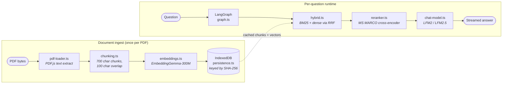
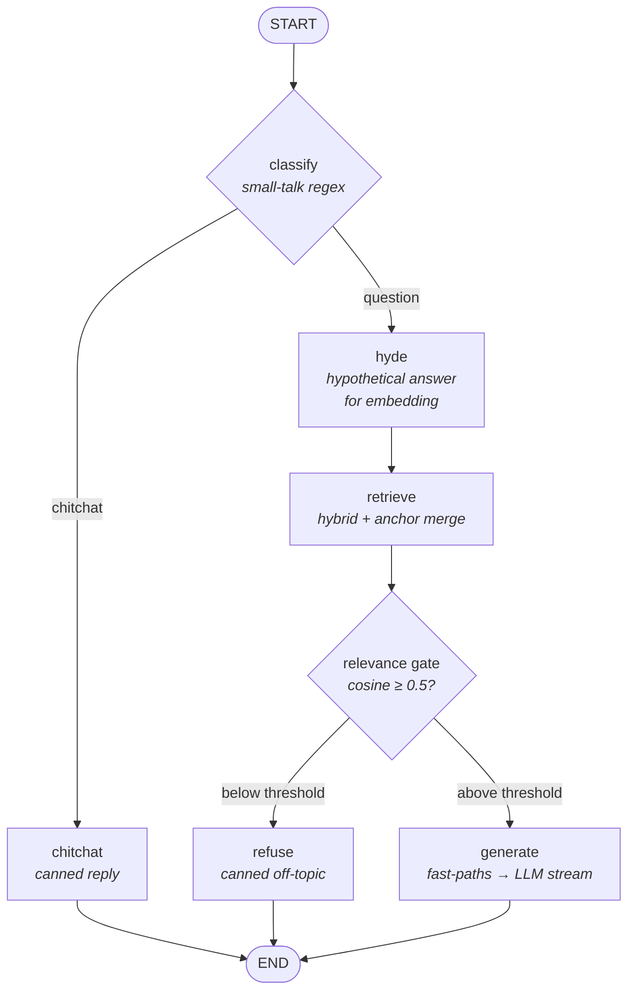
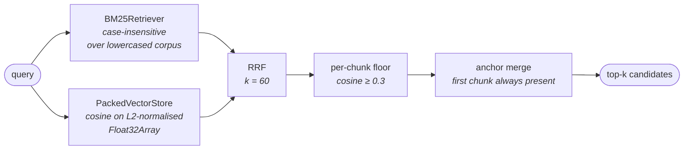
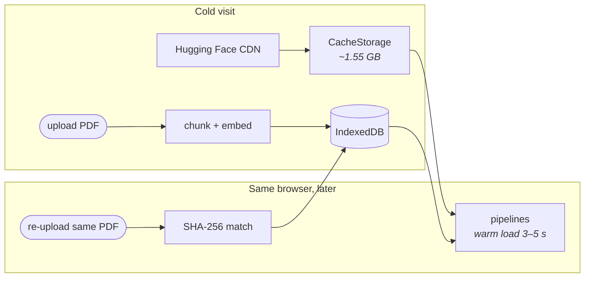

# On-device AI — Implementation Deep Dive

CloakPDF's **Ask your PDF** tool answers natural-language questions
about any uploaded document **entirely in the user's browser**. No
API key, no inference server, no usage quota. The model weights are
downloaded once from Hugging Face's CDN, cached in `CacheStorage`,
and re-used offline forever after.

This document is the implementation reference: what runs, in what
order, where the bytes live, and why the design choices are what
they are. The high-level pitch sits in the [README](../README.md);
everything below is for someone wiring a new question shape into
the pipeline or debugging an unexpected answer.

---

## 1. Model bundle

Three pipelines load together on first use:

| Role             | Model                                                                                 | On disk | Peak RAM | License           |
| ---------------- | ------------------------------------------------------------------------------------- | ------- | -------- | ----------------- |
| Chat _(Compact)_ | [LFM2.5-1.2B-Instruct](https://huggingface.co/LiquidAI/LFM2.5-1.2B-Instruct)          | ~1.2 GB | ~2.0 GB  | LFM Open Lic v1.0 |
| Chat _(Quality)_ | [LFM2-2.6B](https://huggingface.co/LiquidAI/LFM2-2.6B) _(picker upgrade)_             | ~1.5 GB | ~3.5 GB  | LFM Open Lic v1.0 |
| Retrieval        | [EmbeddingGemma-300M](https://huggingface.co/onnx-community/embeddinggemma-300m-ONNX) | ~309 MB | ~400 MB  | Gemma Terms       |
| Reranking        | [MS MARCO MiniLM-L-6-v2](https://huggingface.co/Xenova/ms-marco-MiniLM-L-6-v2)        | ~23 MB  | ~90 MB   | Apache 2.0        |

A fresh visitor on the **Compact** tier downloads **~1.55 GB** total.
The chat tier is user-selectable in the consent modal; both LFM tiers
share the embedder and reranker, so swapping tiers only re-downloads
the chat slot.

The registry of these models lives in
[`src/utils/ai-models.ts`](../src/utils/ai-models.ts) — every entry
carries a history-of-swaps comment explaining the failure modes that
took down each rejected candidate (Qwen 2.5, Llama 3.2 1B, Gemma 4
E2B, SmolLM2 360M/1.7B, SmolLM3-3B). **Read those comments before
proposing a swap.** Most candidates produced gibberish in-browser,
hallucinated content not in the document, or fell into catastrophic
repetition loops at this size class.

---

## 2. End-to-end pipeline



Per-question latency is dominated by the chat model's streaming
phase. Retrieval + reranking together fit in under ~300 ms on a
mid-range desktop; the chat model streams at ~25–40 tok/s on
WebGPU. Re-opening a PDF that's already been ingested skips the
embed step entirely — the vectors come straight out of IndexedDB.

---

## 3. The LangGraph state machine

[`src/rag/graph.ts`](../src/rag/graph.ts) is a six-node graph with
two branch points. The two branches exist because the chat model
can be talked out of grounding by a sufficiently confident off-topic
question; we need defensive gates that _don't_ rely on prompt
discipline.



### Node-by-node

| Node                  | What it does                                                                                              | Why                                                                                                                      |
| --------------------- | --------------------------------------------------------------------------------------------------------- | ------------------------------------------------------------------------------------------------------------------------ |
| **classify**          | Matches `SMALL_TALK_RE` ("hi", "thanks", "ok"…).                                                          | Avoids embedding + retrieval cost on greetings.                                                                          |
| **hyde**              | LLM writes a one-sentence hypothetical answer; both question + hypothetical embed for retrieval.          | Widens semantic search. Skipped for short queries, pasted prose, and fast-path-eligible shapes (phone/email/"who is X"). |
| **retrieve**          | Hybrid BM25 + dense retrieval, fused via RRF; anchor chunks merged in; per-chunk floor (0.3) drops noise. | Catches both exact-keyword ("Sumit") and semantic ("the candidate") matches.                                             |
| **relevance gate**    | Cosine similarity of the best retrieved chunk vs. the question.                                           | Sub-0.5 → off-topic → refuse. Defends against the chat model confabulating general-knowledge answers.                    |
| **generate**          | Runs three deterministic fast-paths first (see §6); LLM streams only on a miss.                           | Avoids known SmolLM-class mis-extractions (mis-copying digits, mislabelling résumés, hallucinating absent topics).       |
| **chitchat / refuse** | Static, canned replies.                                                                                   | Cheap, fixed, predictable.                                                                                               |

---

## 4. Hybrid retrieval (BM25 + dense via RRF)

[`src/rag/retrievers/hybrid.ts`](../src/rag/retrievers/hybrid.ts)
runs both retrievers in parallel and fuses by **Reciprocal Rank
Fusion** with `k = 60`:

```
score(doc) = Σ retrievers   1 / (k + rank(doc, retriever))
```



Why both retrievers:

- **BM25 alone** misses semantic paraphrases — a query "the candidate's experience" won't recall a chunk that only mentions "Sumit's roles".
- **Dense alone** misses high-precision identifiers — "ABC-123" vs. "ABC-124" are nearly identical in embedding space but BM25 nails the difference.

The **anchor chunk** (the first chunk of the document) is always
merged into the result set, even if its retrieval score falls below
the floor. This is because identity questions ("whose résumé is
this?") need the document header, but a query like _whose résumé_
doesn't embed strongly against a literal name + role line — RRF
alone wouldn't surface it.

---

## 5. Chunking, embeddings, vector store

| File                                            | Defaults                                            | Notes                                                                                                                                                                              |
| ----------------------------------------------- | --------------------------------------------------- | ---------------------------------------------------------------------------------------------------------------------------------------------------------------------------------- |
| [`chunking.ts`](../src/rag/chunking.ts)         | 700-char chunks, 100-char overlap, sentence-rounded | Respects abbreviations (`Mr.`, `Dr.`, `etc.`). Greedy packing — a long sentence emits alone rather than splitting mid-clause. `chunkId = "p{page}-{ord}"` for stable dedup.        |
| [`embeddings.ts`](../src/rag/embeddings.ts)     | EmbeddingGemma-300M, 768-d, task-prefixed           | Doc prefix: `"title: none \| text: ..."`. Query prefix: `"task: search result \| query: ..."`. Prefixes meaningfully change scores; both must use the same scheme.                 |
| [`vector-store.ts`](../src/rag/vector-store.ts) | Packed `Float32Array`, row-major, L2-normalised     | Cosine implemented as a dot product. O(N log N) sort for top-k — at PDF scale (thousands of chunks at most) this beats fancier ANN structures both in code and in cold-start time. |

---

## 6. Fast-paths — when the LLM is the wrong tool

[`src/rag/fast-paths.ts`](../src/rag/fast-paths.ts) holds three
deterministic shortcuts that run **before** the chat model. Each
exists because of a specific failure mode the LLM exhibited in
testing — the comment above each function names the offending
behaviour. **Do not loosen or remove them without re-running the
regression set.**

| Fast-path                   | Trigger                                                                                                                  | Defends against                                                                                      |
| --------------------------- | ------------------------------------------------------------------------------------------------------------------------ | ---------------------------------------------------------------------------------------------------- |
| **Verbatim extraction**     | Phone- or email-shaped question + matching regex hit on anchor chunk                                                     | Chat model mis-copying digits ("415" → "451") under sampling.                                        |
| **Document-type detection** | "What is this?" pattern + 2+ résumé section headers in anchor (or structural cues: name + ALL-CAPS role + email + phone) | Chat model labelling résumés as "technical specs" when section headers merged during PDF extraction. |
| **Topic-absence refusal**   | "What does this say about X?" + no meaningful token of X anywhere in retrieved chunks (after stopword filter)            | Chat model fabricating plausible-sounding paragraphs on topics the document never mentions.          |

The chat model only sees a question if **none of the three** fired.
On a miss, the document header + retrieved excerpts are stitched
into a grounded-answer prompt and the model streams a reply.

---

## 7. Chat-model sampling

[`src/rag/chat-model.ts`](../src/rag/chat-model.ts) holds the
sampling profile per tier:

| Knob                   | LFM2.5-1.2B (Compact) | LFM2-2.6B (Quality) | Why                                                                                                      |
| ---------------------- | --------------------- | ------------------- | -------------------------------------------------------------------------------------------------------- |
| `temperature`          | 0.3                   | 0.3                 | Low enough to stay anchored; high enough to vary phrasing.                                               |
| `min_p`                | 0.15                  | 0.15                | Filters the long tail of low-prob tokens.                                                                |
| `repetition_penalty`   | 1.05                  | 1.05                | Gentle — anything stronger pushed the model away from quoting verbatim, which the extraction path needs. |
| `no_repeat_ngram_size` | 6                     | 6                   | Catches degenerate loops ("To To To … ×252") that the rep-penalty alone misses.                          |
| `max_new_tokens`       | 256                   | 256                 | Enough for paragraph answers; short enough that the user isn't waiting 30 s.                             |

The constructor body comment is the running tuning log — when you
change a value, note _why_ there, not in the PR description.

---

## 8. Reranking

[`src/rag/reranker.ts`](../src/rag/reranker.ts) wraps the hybrid
retriever with a cross-encoder pass. Roughly: pull ~18 candidates
via RRF, rescore all `(query, chunk)` pairs in one batched
forward pass, keep the top 6.

The cross-encoder (MS MARCO MiniLM-L-6-v2, 22 M params, 23 MB int8)
is small enough to load in a few seconds on first use, but
meaningfully sharpens relevance beyond what rank fusion alone can do
— the dense retriever surfaces candidates that share _topic_, but a
cross-encoder evaluates question + chunk _jointly_ and catches near-
duplicates that mention the right keywords without actually answering.

---

## 9. Caching + offline use

[`src/rag/persistence.ts`](../src/rag/persistence.ts) keeps two
caches:

- **Per-PDF index** — chunks + packed `Float32Array` vectors,
  stored in IndexedDB (`cloakpdf-rag`, schema version 6), keyed by
  the SHA-256 of the PDF bytes. LRU evicted at 10 PDFs. Peak size
  for a 500-page PDF is ~4 MB of embeddings, so the cap is roughly
  40 MB worst case.
- **Model weights** — stored in the browser's `CacheStorage` (via
  Transformers.js's built-in cache layer). Once downloaded, every
  subsequent visit warm-loads from disk in ~3–5 s with no network
  request.



The "Free memory" and "Delete cached models" actions in the
[AiModelDetailsModal](../src/components/AiModelDetailsModal.tsx) map
to those two layers — `dispose` releases RAM only (keeps disk); `evict`
also wipes `CacheStorage` so the next session re-experiences the
consent + download flow.

---

## 10. Runtime: WebGPU + WASM, and why each one is pinned

[`src/utils/ai-runtime.ts`](../src/utils/ai-runtime.ts) decides
which backend each pipeline runs on:

| Pipeline                  | Backend                              | Why                                                                                                                                                                                        |
| ------------------------- | ------------------------------------ | ------------------------------------------------------------------------------------------------------------------------------------------------------------------------------------------ |
| Chat (LFM2.5 / LFM2)      | WebGPU when available, WASM fallback | The chat model is the slowest pipeline; WebGPU gives ~3–4× tok/s vs WASM. The fallback exists because Safari + older Chromium don't expose `navigator.gpu`.                                |
| Embedder (EmbeddingGemma) | **Pinned to WASM**                   | A known WebGPU LayerNorm fp16 shader compile bug breaks the embedder in Chromium under WebGPU. WASM at `q8` is fast enough for the volume (one batch of chunks per PDF) and doesn't crash. |
| Reranker (MiniLM)         | WASM                                 | int8 quant, small batched forward — WebGPU overhead isn't worth it.                                                                                                                        |

Pipelines are constructed **lazily** — the bytes don't leave the
browser, ever. The runtime keeps one `Promise` per model in
[`_resolvedPipelines`](../src/utils/ai-runtime.ts) so a re-mount can
synchronously discover an already-loaded pipeline without re-asking
the user for consent.

---

## 11. Where to start when something goes wrong

| Symptom                                               | First place to look                                                                             |
| ----------------------------------------------------- | ----------------------------------------------------------------------------------------------- |
| Wrong answer / hallucination                          | [`fast-paths.ts`](../src/rag/fast-paths.ts) — does one of the three apply? If yes, did it fire? |
| Off-topic question got an answer instead of a refusal | [`graph.ts`](../src/rag/graph.ts) `RELEVANCE_THRESHOLD` / `PER_CHUNK_FLOOR`                     |
| Identity question ("whose résumé?") fails             | Anchor merge in [`hybrid.ts`](../src/rag/retrievers/hybrid.ts)                                  |
| Repetition loop ("To To To …")                        | `no_repeat_ngram_size` in [`chat-model.ts`](../src/rag/chat-model.ts)                           |
| Re-upload of same PDF re-embeds                       | [`persistence.ts`](../src/rag/persistence.ts) — schema version bumped?                          |
| First-load downloads each time                        | `CacheStorage` policy in [`ai-runtime.ts`](../src/utils/ai-runtime.ts)                          |
| Different answers on Compact vs Quality tier          | Tier-specific sampling in [`chat-model.ts`](../src/rag/chat-model.ts)                           |

There's a retrieval-only probe at
`tests/e2e/retrieval-probe.ts` that dumps per-retriever hits + scores
per question to JSON — useful for tuning thresholds without firing
the chat model.
